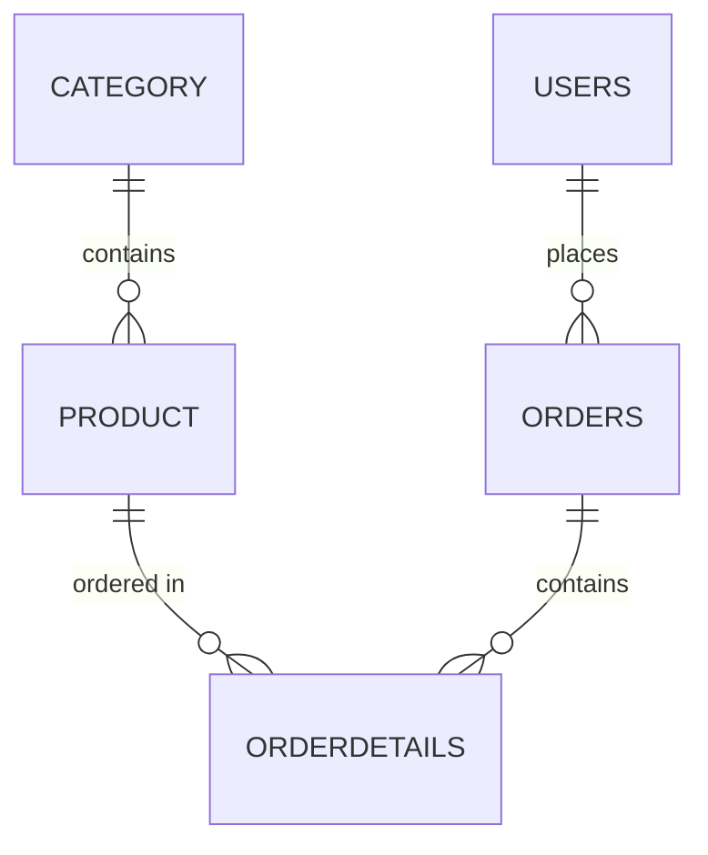

# NovaMart E-Commerce Platform

A professionally structured Hibernate ORM application that models a complete
e-commerce domain: product categories, catalog items, customer accounts,
orders and order line items. The project is built around a clean, layered
architecture (model → DAO → service → application) rather than flat,
constructor-driven CRUD scripts.

## Technology Stack

| Technology | Version | Role |
|---|---|---|
| Java | 21 | Language |
| Hibernate ORM | 6.3.1.Final | JPA persistence (annotations) |
| MySQL | 8.x | Primary runtime database |
| H2 | 2.2.224 | In-memory fallback & test database |
| Maven | 3.9+ | Build & test orchestration |
| JUnit 5 | 5.10.2 | Integration test suite |

## Architecture

```text
EcommerceApp (main runner, MySQL→H2 fallback)
    │
    ▼
EcommerceService  ───── transaction boundaries, business workflows
    │
    ├── CategoryDao ─┐
    ├── ProductDao  ─┤
    ├── UserDao     ├──► Hibernate SessionFactory (HibernateUtil singleton)
    ├── OrderDao   ─┘
    │
    └── PasswordSecurityUtil (SHA-256 hashing)
```

### Layered package layout

```text
com.novamart.ecommerce
├── EcommerceApp.java            # entry point, DB fallback logic, demo run
├── model/                       # JPA entities
│   ├── Category.java
│   ├── Product.java
│   ├── Users.java
│   ├── Orders.java
│   └── OrderDetails.java
├── dao/                         # data access objects
│   ├── CategoryDao.java
│   ├── ProductDao.java
│   ├── UserDao.java
│   └── OrderDao.java
├── service/
│   └── EcommerceService.java    # orchestrates multi-entity workflows
├── security/
│   └── PasswordSecurityUtil.java
└── util/
    └── HibernateUtil.java       # SessionFactory lifecycle manager
```

### Design decisions

- **DAO layer** — every SQL/HQL interaction lives in a dedicated DAO with
  parameterized queries; no query logic in the app or service classes.
- **Service layer** — `EcommerceService` owns transaction boundaries
  (`beginTransaction`/`commit`) and composes DAO calls into workflows such as
  catalog bootstrapping, user registration, order placement and
  catalog decommissioning.
- **Security utility** — `PasswordSecurityUtil.hashPassword()` produces a
  SHA-256 hex digest; raw passwords never touch the database.
- **Session management** — `HibernateUtil` keeps a singleton `SessionFactory`
  and supports loading alternate configuration files (MySQL vs H2 vs tests).

## Entities & Relationships



| Entity | Table | Key Fields | Relationships |
|---|---|---|---|
| `Category` | `category` | `id`, `name` (unique, not null), `description` | One-to-Many → `Product` (cascade all, lazy) |
| `Product` | `product` | `id`, `name` (not null), `price` (decimal, not null), `stockQuantity`, `deleted` (soft-delete flag) | Many-to-One → `Category` (lazy) |
| `Users` | `users` | `id`, `username` (unique), `password` (SHA-256 hash), `email` (unique), `role` (`ADMIN`/`CUSTOMER` enum) | One-to-Many → `Orders` (cascade all, lazy) |
| `Orders` | `orders` | `id`, `orderDate` (not null), `totalAmount` (decimal, not null) | Many-to-One → `Users`, One-to-Many → `OrderDetails` (cascade all, lazy) |
| `OrderDetails` | `orderdetails` | `id`, `quantity` (not null), `unitPrice` (decimal, not null) | Many-to-One → `Orders`, Many-to-One → `Product` |

All one-to-many associations use bidirectional helpers (`addProduct`,
`addOrder`, `addDetail`) so both sides of each relationship stay consistent.

## Prerequisites

- JDK 21
- Maven 3.9+
- MySQL 8 running on `localhost:3306` (optional — H2 fallback is automatic)

## Setup

1. Create the database. The schema itself is generated automatically by
   Hibernate (`hibernate.hbm2ddl.auto=update`); `schema.sql` documents the
   expected structure and can also be applied manually:

   ```sql
   CREATE DATABASE ecommerce_db;
   ```

2. Provide the database password as an environment variable — it is
   referenced from `hibernate.cfg.xml` as `${DB_PASSWORD}`:

   ```bash
   export DB_PASSWORD=your_mysql_root_password
   ```

## Running the Demo Application

```bash
mvn exec:java
```

If MySQL is not reachable on `localhost:3306`, the application prints a
notice and automatically falls back to the in-memory H2 configuration
(`hibernate-h2.cfg.xml`), so the demo works with zero setup:

```bash
mvn exec:java -Dhibernate.config=hibernate-h2.cfg.xml
```

The demo executes these phases in order:

1. **Catalog bootstrap** — idempotently creates the *Consumer Electronics*
   category and its seed products (*Sony WH-1000XM5 Headphones*,
   *MacBook Air M3*, *Logitech MX Master 3S Mouse*)
2. **User registration** — registers *Alex Mercer* (customer) with a
   SHA-256-hashed password
3. **Order placement** — places an order with two line items and computes the
   order total from live catalog prices
4. **Order fetch** — loads the latest order with its user and product
   associations resolved
5. **Named query** — `Product.byCategoryName` lists the category's products
6. **Criteria query** — `CriteriaBuilder` query for active products priced
   between ₹5,000 and ₹35,000
7. **Pagination** — paginates the active catalog (2 items per page)
8. **Soft delete** — decommissions the *Logitech MX Master 3S Mouse* by
   flipping its `deleted` flag instead of removing the row
9. **Post-deletion re-check** — shows the paginated catalog now excluding the
   soft-deleted product

The demo is fully idempotent: re-running it performs no duplicate inserts and
raises no constraint violations.

## Running the Tests

Tests run against an in-memory H2 database — no MySQL needed:

```bash
mvn clean test
```

`EcommerceIntegrationTest` covers the full domain surface:

| # | Test | Verifies |
|---|---|---|
| 1 | `testSaveAndFindCategory` | persist + reload a `Category` |
| 2 | `testSaveProductWithCategory` | `Product` ↔ `Category` association |
| 3 | `testUserRegistrationWithPasswordHashing` | SHA-256 password hashing on registration |
| 4 | `testCreateOrderWithMultipleOrderDetails` | order total + multiple `OrderDetails` |
| 5 | `testFetchOrderWithUserAndProductAssociations` | lazy associations resolved on fetch |
| 6 | `testUpdateCategoryMerge` | UPDATE via `session.merge` |
| 7 | `testCascadeDeleteCategoryAndProducts` | `CascadeType.ALL` removes child products |
| 8 | `testFindProductsByCategoryNamedQuery` | bonus: named query |
| 9 | `testCriteriaQueryPriceFilter` | bonus: `CriteriaBuilder` + price range |
| 10 | `testSoftDeletePreservesRow` | bonus: soft delete keeps the row, hides it from active listings |
| 11 | `testPaginationSplitsRecords` | bonus: `setFirstResult`/`setMaxResults` paging |
| 12 | `testFullServicePipelineExecution` | end-to-end service pipeline + idempotency re-run |

## Project Structure

```text
src/
├── main/
│   ├── java/com/novamart/ecommerce/
│   │   ├── EcommerceApp.java
│   │   ├── model/           # Category, Product, Users, Orders, OrderDetails
│   │   ├── dao/             # CategoryDao, ProductDao, UserDao, OrderDao
│   │   ├── service/         # EcommerceService
│   │   ├── security/        # PasswordSecurityUtil
│   │   └── util/            # HibernateUtil
│   └── resources/
│       ├── hibernate.cfg.xml      # MySQL configuration
│       └── hibernate-h2.cfg.xml   # H2 in-memory configuration (fallback)
└── test/
    ├── java/com/novamart/ecommerce/
    │   └── EcommerceIntegrationTest.java
    └── resources/
        └── hibernate-test.cfg.xml # H2 in-memory configuration for tests

pom.xml
schema.sql
```

## Notes

- Passwords are stored as SHA-256 hex digests via
  `security.PasswordSecurityUtil`, never as plain text.
- Bonus features implemented:
  - **Named query** — `Product.byCategoryName` fetches products by category
    name.
  - **Criteria query** — `CriteriaBuilder`-based price-range filter over
    active products (`ProductDao.findActiveByPriceRange`).
  - **Soft delete** — the `Product.deleted` flag is set via `merge` instead of
    `session.remove()`; active listings and criteria queries filter on
    `deleted = false` while order history still resolves decommissioned
    products.
  - **Pagination** — `setFirstResult`/`setMaxResults` paging for the product
    catalog (`ProductDao.findActivePaginated` + `countActive`).
- Connection details (driver, URL, user) live in
  `src/main/resources/hibernate.cfg.xml`; the password is injected from the
  `DB_PASSWORD` environment variable.
